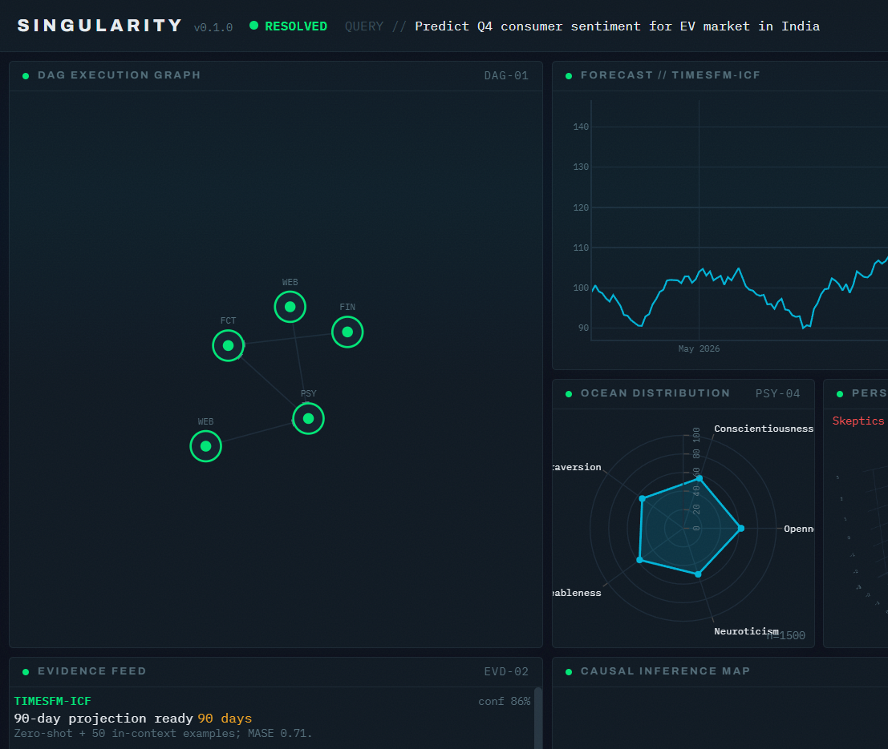

# Project Singularity — Agentic Behavioral Simulation Platform

Agentic behavioral simulation platform with a polished, Bloomberg Terminal-style
React dashboard driven by a Server-Sent Events (SSE) stream.

The repository now ships a **real `backend/`** that runs genuine AI logic —
local **Gemma 4B via Ollama** for DAG decomposition + persona simulation, the
gated **Days234 personality engine** for OCEAN scoring, real **evidence agents**
(DuckDuckGo / Serper / yFinance / Wikipedia), dependency-safe
**causal** (statsmodels Granger + custom numpy Hawkes MLE) and **forecast**
(Google TimesFM + Prophet ensemble with native intervals + MASE) engines, an optional
**OpenRouter** polishing layer, and optional **Supabase** persistence. It emits
the exact SSE contract the dashboard already consumes.



> If the screenshot above is missing, run the app (below) and you'll see the
> live dashboard: DAG execution graph, forecast with prediction intervals, OCEAN
> radar, 3D persona space, sentiment heatmap, causal map, evidence feed, and a
> streaming McKinsey-grade report.

---

## Architecture

```
   query ─▶ POST /api/query ─▶ flow_uuid ─▶ GET /api/stream/{flow_uuid}  (SSE)
                                                        │
                 ┌──────────────────────────────────────▼─────────────────────┐
                 │  backend/  SingularityFlow (async @start/@listen-style)      │
                 │   decompose_dag (Gemma PT-01)        -> dag_created          │
                 │   evidence agents (parallel)         -> agent_started/result │
                 │   psychometric (Gemma PT-02 + engine)-> persona_batch x6     │
                 │   causal (Granger + Hawkes)          -> causal_graph         │
                 │   forecast (TimesFM + Prophet ensemble)-> forecast_ready       │
                 │   report (Gemma -> OpenRouter PT-03) -> report_section x4    │
                 │                                      -> complete             │
                 └──────────────────────────────────────┬─────────────────────┘
                            SSE events (text/event-stream)│
                                                          ▼
   useSSEStream (EventSource) ─▶ Zustand store ─▶ Terminal shell + 13 panels
```

The SSE event contract is authoritative and lives in
[frontend/src/types/events.ts](frontend/src/types/events.ts); the Python mirror
is [backend/state.py](backend/state.py).

### Resilience
Every phase is wrapped so a failure emits an `error` event and the run still
reaches `complete`. The LLM, personality engine, evidence sources, and Supabase
all degrade gracefully: no HF token → analytic OCEAN fallback; no OpenRouter →
local Gemma prose; no Supabase service key → in-memory store; a delisted ticker
→ deterministic synthetic series. A run always completes and populates the UI.

---

## Quick start

### Prerequisites
- Node.js >= 18 (tested on 22)
- Python >= 3.10 (tested on 3.14)
- **Ollama** running locally with a Gemma model pulled:
  ```bash
  ollama pull gemma4         # or set OLLAMA_MODEL to your tag (e.g. gemma2:4b)
  ```
- Optional: a Hugging Face token with access to `Days234/personality-engine`,
  an OpenRouter API key, a Serper key, and a Supabase service key. All optional —
  the backend degrades gracefully without them.

### Quick start

Terminal 1 — backend:
```bash
cd backend
python -m pip install -r requirements.txt   # reuses an existing CPU torch if present
copy .env.example .env                       # Windows  (cp on macOS/Linux)
#   then edit backend/.env: set HF_TOKEN, OPENROUTER_API_KEY, SUPABASE_SERVICE_KEY,
#   SERPER_API_KEY as available. Defaults already point at local Ollama gemma4.
python -m uvicorn main:app --port 8000
```

Terminal 2 — frontend:
```bash
cd frontend
npm install
npm run dev
```

Open http://localhost:3000. A simulation auto-runs on load (default query:
"Analyze market sentiment and behavioral drivers for the next quarter"); click **Run Sim** to
replay. Vite proxies `/api` to the backend on `:8000`.

> On CPU-only hardware the 8B Gemma model serializes calls, so a full run takes
> a few minutes. Tune `PERSONA_ARCHETYPES` in `backend/.env` (the 1,500-agent
> population is expanded statistically from these LLM-simulated archetypes).

---

## Scripts (frontend)

| Command | Description |
| --- | --- |
| `npm run dev` | Vite dev server on :3000 with HMR |
| `npm run build` | Type-check + production build to `dist/` |
| `npm run typecheck` | `tsc --noEmit` |
| `npm run preview` | Serve the production build |

---

## Project structure

```
Singularity_V-2.0/
├─ backend/                      Real FastAPI + async flow (live AI logic)
│  ├─ main.py                    /api/query, /api/stream, /api/report, /api/sessions, /api/persona/preview
│  ├─ flow.py                    SingularityFlow async orchestrator + phases
│  ├─ config.py                  pydantic-settings (.env)
│  ├─ state.py                   Pydantic payload models (mirror of events.ts)
│  ├─ sse.py                     per-flow async event bus + SSE framing
│  ├─ auth.py                    optional Supabase JWT (disabled by default)
│  ├─ prompts.py                 PT-01 DAG, PT-02 persona, PT-03 polish
│  ├─ search_demos.py            CLI menu demoing the 6 LangChain search providers
│  ├─ .env.example               documented env template (copy to .env)
│  ├─ llm/                       ollama_client (gemma4) + openrouter_client
│  ├─ tools/                     LangChain tool layer (flag-gated)
│  │  ├─ registry.py             source routing + StructuredTool exposure
│  │  ├─ sources.py              async fetchers (Serper/DDG/Parallel/arXiv/...)
│  │  └─ search_providers.py     6 reusable fns over official LangChain classes
│  ├─ agents/
│  │  ├─ dag.py                  Gemma -> validated JSON base_roots
│  │  ├─ evidence.py             DuckDuckGo/Serper/yFinance/Wikipedia
│  │  ├─ personality.py          Days234 engine wrapper + analytic fallback
│  │  ├─ psychometric.py         archetypes -> Gemma sim -> PCA/k-means -> 1500
│  │  ├─ causal.py               Granger (statsmodels) + numpy Hawkes MLE
│  │  └─ forecast.py             TimesFM + Prophet ensemble + MASE
│  ├─ report/generate.py         Gemma findings -> OpenRouter polish
│  └─ db/
│     ├─ supabase_client.py      optional persistence (degrades to in-memory)
│     └─ migrations/001_initial.sql   sessions/reports/forecasts + pgvector + RLS
├─ frontend/                     React + TS + Vite dashboard
│  ├─ src/
│  │  ├─ types/events.ts         SSE event contract (source of truth)
│  │  ├─ store/sessionStore.ts   Zustand event-sourced state
│  │  ├─ hooks/useSSEStream.ts   EventSource + resume
│  │  ├─ api/singularity.ts      backend URLs + query submit
│  │  ├─ lib/                    theme, plotly factory, formatters
│  │  ├─ styles/                 tokens.css + tailwind globals
│  │  └─ components/
│  │     ├─ shell/               HeaderBar, PanelGrid, Panel, MetricsStrip, Toasts
│  │     └─ panels/              DAG, OCEAN radar, heatmap, forecast,
│  │                             3D scatter, causal map, evidence, report
│  └─ tailwind.config.ts         Bloomberg-dark design tokens
```

---

## Panels (spec section 10)

| Panel | Tech | Source event |
| --- | --- | --- |
| DAG Execution Graph | D3 force | `dag_created`, `agent_started/result` |
| Prediction Overview | Plotly gauge + sparkline | `forecast_ready`, `causal_graph` |
| Forecast (TimesFM-ICF) | Plotly | `forecast_ready` |
| OCEAN Distribution | Plotly radar | `persona_batch` |
| Persona PCA Space | Plotly 3D | `persona_batch` |
| Sentiment Heatmap | D3 | `persona_batch` |
| Agent Persona Opinions | virtualized list | `persona_batch.opinions` |
| Sentiment Distribution | Plotly bar | `persona_batch` |
| Evidence Feed | list | `agent_result` |
| Web Source Breakdown | Plotly pie | `agent_result` |
| Evidence Time Series | Plotly multi-line | `evidence_series` |
| Causal Mapping | D3 goal-centric | `causal_graph` |
| Strategic Report | 7-section consulting markdown + PDF/Word export | `report_section` |

The report emits seven sections: Executive Summary, **External Intelligence & Sources**
(web-search citations), Key Findings, Strategic Implications, Risk Flags, Simulation
Applications, and Council Consensus. Enable `LANGCHAIN_ENABLED=true` plus search API
keys (Serper, Parallel) for richer source diversity.

---

## Design system

Bloomberg-dark terminal aesthetic (spec section 10.2). Tokens are defined once
in [frontend/tailwind.config.ts](frontend/tailwind.config.ts) and mirrored for
imperative renderers in [frontend/src/lib/theme.ts](frontend/src/lib/theme.ts)
and [frontend/src/styles/tokens.css](frontend/src/styles/tokens.css):
background `#0A0E1A`, teal `#00B4D8`, orange `#F5A623`, positive `#00E676`,
alert `#FF4C4C`. Typography pairs **Archivo** (display) with **IBM Plex Mono**
(data). Subtle grain + scanline overlays add terminal atmosphere; panels load
with a staggered reveal and active agents pulse.

---

## Backend API (spec section 4.2)

| Method | Endpoint | Description |
| --- | --- | --- |
| `GET`  | `/api/health` | Service status + configured integrations |
| `POST` | `/api/query` | Submit a query; returns `flow_uuid` + `session_id` |
| `GET`  | `/api/stream/{flow_uuid}` | SSE stream of the live run |
| `GET`  | `/api/report/{session_id}` | Fetch a completed report |
| `GET`  | `/api/sessions` | List recent sessions |
| `GET`  | `/api/report/{session_id}/export?format=pdf\|docx` | Export report with embedded charts |
| `POST` | `/api/persona/preview` | Simulate a single IPIP-300 persona response |

JWT auth (Supabase) is wired but **disabled by default** (`AUTH_ENABLED=false`),
since the dashboard sends no token yet.

---

## Search providers (LangChain)

The backend ships six first-class search providers built on the official
LangChain integration classes, exposed as reusable functions in
[backend/tools/search_providers.py](backend/tools/search_providers.py):

| Function | LangChain class | Key required |
| --- | --- | --- |
| `duckduckgo_search(query)` | `DuckDuckGoSearchRun` | none |
| `duckduckgo_results(query)` | `DuckDuckGoSearchResults` | none |
| `serper_search(query)` | `GoogleSerperResults` + `GoogleSerperAPIWrapper` | `SERPER_API_KEY` |
| `parallel_search(objective)` | `ParallelWebSearchTool` | `PARALLEL_API_KEY` |
| `parallel_extract(urls)` | `ParallelExtractTool` | `PARALLEL_API_KEY` |
| `parallel_chat(question)` | `ChatParallelWeb` | `PARALLEL_API_KEY` |

Each function has an `async` twin (`aduckduckgo_search`, `aserper_search`, ...),
full type hints/docstrings, structured logging on the `singularity.*` namespace,
and raises a typed `ProviderError` (never crashes) when a package or key is
missing. Everything is import-guarded, so the backend still boots without
`langchain-parallel` installed.

### Installation

DuckDuckGo + Serper wrappers come from `langchain-community` (already a core
dependency); the Parallel tools add one package. Both are in
[backend/requirements.txt](backend/requirements.txt):

```bash
cd backend
python -m pip install -r requirements.txt
# or just the search extras:
python -m pip install langchain-community ddgs langchain-parallel
```

Then set the keys you need in `backend/.env` (template:
[backend/.env.example](backend/.env.example)):

```env
SERPER_API_KEY=
PARALLEL_API_KEY=
```

### CLI demo

```bash
cd backend
python search_demos.py
```

```text
1. DuckDuckGo Search
2. DuckDuckGo Results
3. Google Serper Search
4. Parallel Search
5. Parallel Extract
6. Parallel Chat
```

Non-interactive usage for scripting/CI:

```bash
python search_demos.py --choice 1 --query "What is LangChain?"
python search_demos.py --choice 5 --urls https://en.wikipedia.org/wiki/Artificial_intelligence
```

### Programmatic usage

```python
from tools.search_providers import duckduckgo_search, serper_search, parallel_chat

print(duckduckgo_search("What is LangChain?"))
print(serper_search("What is LangChain?"))      # needs SERPER_API_KEY
print(parallel_chat("What are the latest AI breakthroughs?"))  # needs PARALLEL_API_KEY
```

### Pipeline wire-in (optional)

Set `LANGCHAIN_NATIVE_TOOLS=true` to route the existing evidence fetchers
(`fetch_serper` / `fetch_ddg` / `fetch_parallel` in
[backend/tools/sources.py](backend/tools/sources.py)) through these official
wrappers instead of the hand-rolled `httpx`/`ddgs` path. It falls back
transparently to the legacy fetchers when the flag is off or the packages are
absent, so existing runs are unaffected by default.

---

## Pragmatic dependency choices

The spec lists some libraries that lack wheels on Python 3.14 / Windows. The
backend uses dependency-safe equivalents that produce real results:

| Spec library | Used here | Notes |
| --- | --- | --- |
| CrewAI Flow | lightweight async orchestrator | mirrors `@start/@listen`; no hard dep |
| `tick` (Hawkes) | custom numpy/scipy exp-kernel **Hawkes MLE** | real branching-ratio estimate |
| TimesFM / Prophet | **TimesFM + Prophet** ensemble (native intervals) | optional **Chronos** if installed; `timesfm` may require Python ≤3.11 |
| 1,500 live Gemma calls | ~N LLM archetypes + statistical expansion | infeasible to call 1,500× on CPU |

Optional extras (`requirements-optional.txt`): `chronos-forecasting`, `timesfm[torch]`, `prophet`, `crewai`.

---

## Verification

Verified end-to-end on Windows (Python 3.14, CPU torch, Ollama `gemma4:latest`):

- Backend imports + payload-contract check pass.
- A full **live** run streamed all nine SSE event types and populated every
  panel from real data: **NODES 6/6, PERSONAS 1,500/1,500, EVIDENCE 21,
  SIG. CAUSAL EDGES 3**, forecast with 90-day TimesFM/Prophet intervals + computed
  MASE, and a streaming report. Real DuckDuckGo/Wikipedia evidence was fetched;
  a delisted ticker correctly fell back to a synthetic macro series.
- Supabase schema applied to the live project
  ([backend/db/migrations/001_initial.sql](backend/db/migrations/001_initial.sql)).
- Frontend: `npm run typecheck` and `npm run build` pass.
