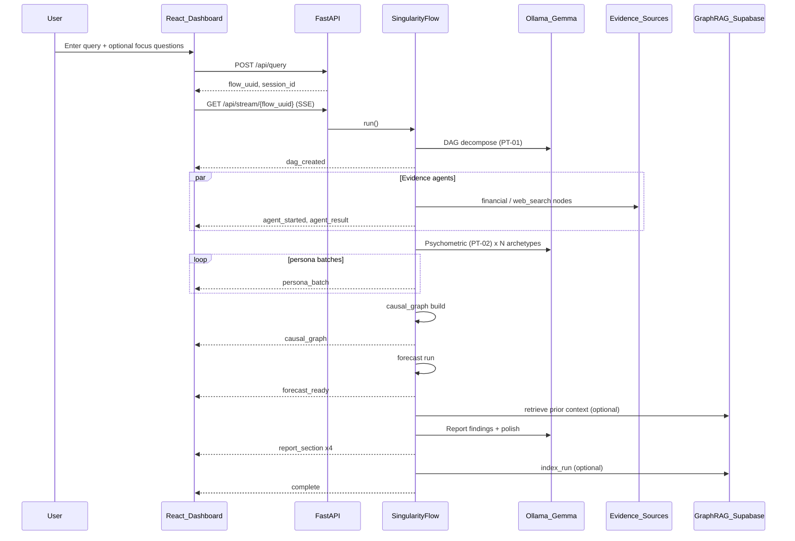

# Project Singularity — Overall System Report

**Version:** 0.1.0  
**Repository:** `Singularity_V-2.0`  
**Last updated:** 2026-06-02  

This document describes how the platform works end-to-end: orchestration logic, quantitative calculations, prediction synthesis, backend and frontend architecture, API contracts, knowledge-base (RAG) digestion, and web-source intelligence gathering.

---

## Table of contents

1. [Executive summary](#1-executive-summary)
2. [End-to-end data flow](#2-end-to-end-data-flow)
3. [Code logic and orchestration](#3-code-logic-and-orchestration)
4. [Overall calculation model](#4-overall-calculation-model)
5. [Prediction calculations](#5-prediction-calculations)
6. [Prediction Overview panel (frontend)](#6-prediction-overview-panel-frontend)
7. [Backend architecture](#7-backend-architecture)
8. [Frontend architecture](#8-frontend-architecture)
9. [API connections](#9-api-connections)
10. [Knowledge base digestion (Graph-RAG)](#10-knowledge-base-digestion-graph-rag)
11. [Web source intelligence](#11-web-source-intelligence)
12. [Configuration and degradation](#12-configuration-and-degradation)
13. [Key file index](#13-key-file-index)

---

## 1. Executive summary

Project Singularity is an **agentic behavioral simulation platform**. A user submits a natural-language query; the backend decomposes it into a DAG of tasks, collects real or synthetic evidence from the web and markets, simulates up to **1,500 IPIP-300 personas** with local **Gemma (Ollama)**, runs **causal inference** (Granger + Hawkes) and **time-series forecasting** (TimesFM + Prophet ensemble), then synthesizes a **four-section strategic report**. Results stream to a Bloomberg-style React dashboard over **Server-Sent Events (SSE)**.

Design principles:

- **Single SSE contract** mirrored in Python (`backend/state.py`) and TypeScript (`frontend/src/types/events.ts`).
- **Graceful degradation** at every layer (Ollama down → template DAG; no Serper → DuckDuckGo; no Supabase → in-memory store).
- **Optional accelerators**: OpenRouter polish, CrewAI report crew, LangChain tool layer, Graph-RAG, Chronos forecast, GDELT news.

---

## 2. End-to-end data flow



---

## 3. Code logic and orchestration

### 3.1 Entry point

| Component | Role |
| --- | --- |
| [`backend/main.py`](../backend/main.py) | FastAPI app, CORS, lifespan Ollama health check |
| [`backend/flow.py`](../backend/flow.py) | `SingularityFlow` — async phase runner |
| [`backend/sse.py`](../backend/sse.py) | `EventBus` + SSE framing (`id`, `event`, `data`) |
| [`backend/session_registry.py`](../backend/session_registry.py) | In-memory cache of completed `SingularityState` (last 20 sessions) for report regeneration |

### 3.2 Phase pipeline (`SingularityFlow.run`)

Executed **sequentially**; each phase is wrapped so failures emit `error` events but the run still reaches `complete`:

| Order | Phase | Module | SSE events |
| --- | --- | --- | --- |
| 1 | DAG decomposition | `agents/dag.py` | `dag_created` |
| 2 | Evidence (parallel per node) | `agents/evidence.py` | `agent_started`, `agent_result` |
| 3 | Psychometric simulation | `agents/psychometric.py` | `persona_batch` (×6 default), `agent_result` |
| 4 | Causal inference | `agents/causal.py` | `causal_graph` |
| 5 | Forecast | `agents/forecast.py` | `forecast_ready`, `agent_result` |
| 6 | RAG context (optional) | `rag/retriever.py` | (internal — `state.metrics["rag_context"]`) |
| 7 | Report synthesis | `report/generate.py` | `report_section` ×4 |
| 8 | RAG indexing (optional) | `rag/index.py` | (internal) |
| 9 | Finish | `flow._finish` | `complete` |

### 3.3 Shared state (`SingularityState`)

Threaded through all phases ([`backend/state.py`](../backend/state.py)):

- `query`, `flow_uuid`, `session_id`, `web_sources_enabled`
- `dag`, `evidence[]`, `series[]` (time series for causal/forecast)
- `persona_responses[]`, `persona_opinions[]`, `ocean_mean`
- `forecast`, `causal`, `report_sections[]`
- `metrics` dict (persona count, `focus_questions`, `rag_context`, etc.)

### 3.4 DAG decomposition logic

**File:** [`backend/agents/dag.py`](../backend/agents/dag.py)

1. Prompt local Gemma with `DAG_SYSTEM` / `DAG_USER` ([`backend/prompts.py`](../backend/prompts.py)).
2. Parse JSON `base_roots[]` into `DagNode` records (`id`, `task`, `agent_type`, `dependencies`, `priority`).
3. Valid `agent_type` values: `web_search`, `financial`, `psychometric`, `forecast`.
4. Repair: ensure coverage of required agent types, fix broken dependency edges, cap at 8 nodes.
5. On failure → deterministic default DAG (macro, trends, psychometric, forecast nodes).

### 3.5 Psychometric pipeline logic

**File:** [`backend/agents/psychometric.py`](../backend/agents/psychometric.py)

High-level steps:

1. **Archetypes:** Build ~`PERSONA_ARCHETYPES` (default 36) OCEAN profiles on a 25/50/75 grid with jitter, or sample from optional IPIP NPZ population ([`agents/ipip.py`](../backend/agents/ipip.py)).
2. **LLM simulation:** For each archetype, Gemma (PT-02) returns JSON: `sentiment_score`, `behavioral_intent`, `emotional_state`, `key_concerns`, `action_likelihood`. Temperature scales with Neuroticism.
3. **Validation:** Generated text is rescored through **Days234 personality engine** ([`agents/personality.py`](../backend/agents/personality.py)) → `validated_ocean` + 30 facets; analytic fallback if HF token missing.
4. **Population expansion:** Archetype responses are statistically expanded to `PERSONA_POPULATION` (default 1,500) via jittered OCEAN/facet/sentiment replication.
5. **Embedding space:** `features = [OCEAN | facets]` → **PCA (SVD)** to 3D → **k-means (k=3)** → cluster labels Skeptics / Pragmatists / Enthusiasts.
6. **Streaming:** Emit `persona_batch` events (default 6 batches × 250 profiles) with `ocean_mean`, `points`, `heatmap`, `opinions`.

### 3.6 Report synthesis logic

**File:** [`backend/report/generate.py`](../backend/report/generate.py)

1. Build `_structured_data(state)` — evidence highlights, OCEAN mean, sentiment, forecast summary, top causal edges, optional `focus_questions`.
2. If `CREWAI_ENABLED` → [`crew/crew.py`](../backend/crew/crew.py) persona-injected synthesis.
3. Else → Gemma findings (`FINDINGS_SYSTEM` / `FINDINGS_USER`) → polish via OpenRouter (if `USE_OPENROUTER_POLISH=true`) or local Gemma JSON → template fallback.
4. Output five sections: Executive Summary, Key Findings, Strategic Implications, Risk Flags, Simulation Applications.

Post-run **regeneration:** `POST /api/report/generate` reloads cached state from `session_registry` and re-runs `report_agent.build()` only.

---

## 4. Overall calculation model

“Overall” outcomes combine **persona sentiment**, **macro/evidence series**, **forecast trajectory**, and **causal graph scores** into dashboard-visible metrics.

### 4.1 Population-level sentiment

From psychometric expansion:

```text
mean_sentiment = mean(persona_responses[].sentiment_score)   # range [-1, 1]
```

Used in report `_structured_data`, causal series assembly, and forecast synthetic target when no market series exists.

### 4.2 OCEAN mean

Per batch and final:

```text
ocean_mean[d] = mean(pop_ocean[:, d])   for d in {O, C, E, A, N}   # 0..100 scale
```

### 4.3 Sentiment heatmap (facet × stimulus)

**Function:** `_heatmap()` in psychometric.py

For each of 30 IPIP facets and 8 generic stimuli:

```text
facet_norm = (facet_mean - 50) / 50
value[fi, si] = clamp(0.5 * facet_norm * polarity(si) + 0.4 * mean_sent + 0.1 * sin(fi+si), -1, 1)
```

### 4.4 Evidence confidence

Per evidence node, `AgentResultPayload.confidence` is set by the collector (e.g. yFinance 0.82, synthetic 0.4, psychometric ~0.9).

### 4.5 Metrics strip (frontend)

Derived in [`frontend/src/components/shell/MetricsStrip.tsx`](../frontend/src/components/shell/MetricsStrip.tsx):

| Metric | Calculation |
| --- | --- |
| Nodes resolved | Count `nodeStatus[id] === "done"` |
| Personas | `personasSimulated / personaTarget` from `persona_batch.cumulative_profiles` |
| Evidence items | `evidence.length` |
| MASE | `forecast.mase_score` |
| Sig. causal edges | `causal.edges` where `p_value < 0.05` |
| Net sentiment proxy | `(oceanMean.E - oceanMean.N) / 100` |

---

## 5. Prediction calculations

Two engines feed “prediction”: **forecast** (time series) and **causal** (drivers + overall score).

### 5.1 Forecast engine

**File:** [`backend/agents/forecast.py`](../backend/agents/forecast.py)

**Target series selection:**

1. Longest `state.series` with ≥12 points (from evidence), else
2. Synthetic “Projected Demand Index” from persona mean sentiment + AR-like noise.

**Model priority:**

| Priority | Engine | Output label |
| --- | --- | --- |
| 1 | Chronos (`amazon/chronos-t5-small`) if installed | `Chronos` |
| 2 | TimesFM + Prophet ensemble (both available) | `TimesFM+Prophet-ICF` |
| 3 | TimesFM only (`google/timesfm-2.5-200m-pytorch`) | `TimesFM-ICF` |
| 4 | Prophet only | `Prophet` |
| 5 | Linear damped analytic fallback | `ETS-Damped-Fallback` |

**Ensemble rules (TimesFM + Prophet):**

```text
point = mean(timesfm_median, prophet_yhat)
lower = min(timesfm_q05, prophet_yhat_lower)
upper = max(timesfm_q95, prophet_yhat_upper)
```

**Point forecast:** TimesFM `model.forecast(horizon)` or Prophet `predict()` tail (default horizon from `FORECAST_HORIZON_DAYS` in config).

**90% intervals:** native quantile head (TimesFM) and Prophet `yhat_lower`/`yhat_upper` (ensemble uses conservative min/max envelope).

**MASE (hold-out):**

```text
train, test = split tail (h_val ≈ 5..20 days)
model_mae = mean(|pred_test - test|)
naive_mae = mean(|diff(train)|)
MASE = model_mae / naive_mae
```

**SSE payload:** `forecast_ready` with `history` (last 60 points), `predictions`, `intervals`, `mase_score`, `model`, `metric`.

### 5.2 Causal inference engine

**File:** [`backend/agents/causal.py`](../backend/agents/causal.py)

**Series assembly (`_assemble_series`):**

- All evidence `TimeSeries` (≥8 points) by name.
- Synthetic **Agent Sentiment** AR(1) series from population mean sentiment.
- **Outcome Signal** = smoothed mix of normalized sentiment + first macro driver.

All series resampled to length **60** for pairwise tests.

**Granger causality** (statsmodels when available; else cross-correlation proxy):

```text
For each ordered pair (cause, effect), lag in 1..6:
  p_value, lag = grangercausalitytests(effect, cause)
```

**Hawkes excitation weight:**

```text
events = indices where diff(effect) > threshold
branching_ratio = alpha/beta from exp-kernel Hawkes MLE (scipy.optimize)
weight = clip(0.5 * branching_ratio + 0.5 * |xcorr(cause, effect, lag)|, 0, 1)
```

**Edge filter:** Keep edges with `p_value ≤ 0.10`; if &lt;3 edges, take top by (p, -weight). Cap at 12 edges.

**Influence labels:** `++`, `+`, `-` from p-value and weight thresholds.

**Per-node prediction score:**

```text
pred_node = clip(mean(last 14 values of series), 0, 100)
```

**Overall prediction (`_overall_prediction`) — primary “outcome %”:**

```text
parts = []
if personas: parts.append(50 + mean(sentiment) * 35)
if "sentiment" in series name: parts.append(mean(last 7 days))
if forecast: parts.append(clip(50 + (pred_last - hist_last) / |hist_last| * 100, 0, 100))
overall_prediction = clip(mean(parts), 0, 100)
```

**Criticality:** Sum incoming/outgoing edge weights per node, normalize to 0–100 (goal node fixed at 100).

**SSE payload:** `causal_graph` with `root_goal`, `overall_prediction`, `nodes[]`, `edges[]`.

---

## 6. Prediction Overview panel (frontend)

**File:** [`frontend/src/components/panels/PredictionOverview.tsx`](../frontend/src/components/panels/PredictionOverview.tsx)

This panel does **not** recompute predictions; it **visualizes** backend outputs:

| UI element | Data source | Rendering |
| --- | --- | --- |
| Title | `rootQuery` or `causal.root_goal` | Truncated text |
| Gauge (0–100%) | `causal.overall_prediction` | Plotly indicator, color bands 0–40 / 40–65 / 65–100 |
| Sparkline | `forecast.history[-30]` + `forecast.predictions` | Plotly line + area fill |

Panel is enabled when `forecast !== null` **or** `causal !== null` ([`PanelGrid.tsx`](../frontend/src/components/shell/PanelGrid.tsx)).

---

## 7. Backend architecture

```
backend/
├── main.py              # FastAPI routes, SSE stream, report export
├── flow.py              # SingularityFlow orchestrator
├── config.py            # pydantic-settings (.env)
├── state.py             # Pydantic models (SSE contract)
├── sse.py               # EventBus
├── session_registry.py  # Completed-run cache
├── auth.py              # Optional Supabase JWT (AUTH_ENABLED)
├── prompts.py           # PT-01 DAG, PT-02 persona, PT-03 polish
├── agents/
│   ├── dag.py           # Query → DAG
│   ├── evidence.py      # Web + financial intel
│   ├── psychometric.py  # 1500-agent simulation
│   ├── personality.py # Days234 OCEAN engine
│   ├── causal.py        # Granger + Hawkes graph
│   ├── forecast.py      # TimesFM + Prophet / Chronos
│   └── ipip.py          # Optional NPZ population
├── llm/
│   ├── ollama_client.py # Local Gemma
│   └── openrouter_client.py
├── report/
│   ├── generate.py      # Report sections
│   └── export.py        # PDF / DOCX with charts
├── rag/                 # Optional Graph-RAG
│   ├── embeddings.py    # sentence-transformers
│   ├── vectorstore.py   # Supabase pgvector
│   ├── index.py         # Post-run indexing
│   └── retriever.py     # Pre-report retrieval
├── crew/                # Optional CrewAI report
├── tools/               # Optional LangChain evidence layer
├── db/
│   ├── supabase_client.py
│   └── migrations/
└── requirements.txt
```

### Persistence (optional Supabase)

| Table | Purpose |
| --- | --- |
| `simulation_sessions` | Query, flow_uuid, status, dag_json |
| `report_outputs` | Section markdown + embeddings |
| `forecast_results` | Predictions, MASE |
| `evidence_chunks` | RAG vectors (migration `002_rag.sql`) |

Without Supabase, [`db/supabase_client.py`](../backend/db/supabase_client.py) uses in-memory dicts.

### Async and threading

- FastAPI handles concurrent HTTP clients.
- Blocking work: `asyncio.to_thread` in forecast; evidence uses thread pool for yFinance/HTTP.
- Evidence nodes run with `asyncio.gather` (bounded parallelism).
- Psychometric archetype LLM calls use `Semaphore(max_concurrent_agents)`.

---

## 8. Frontend architecture

```
frontend/
├── src/
│   ├── App.tsx                 # Query state, auto-run, report handlers
│   ├── api/singularity.ts      # REST + health
│   ├── hooks/useSSEStream.ts   # EventSource + mock fallback
│   ├── lib/sseDispatch.ts      # RAF-batched SSE apply
│   ├── store/sessionStore.ts   # Zustand event-sourced state
│   ├── types/events.ts         # SSE contract (source of truth)
│   ├── components/
│   │   ├── shell/              # HeaderBar, QueryBar, PanelGrid, Panel
│   │   ├── panels/             # Visualization panels
│   │   └── report/             # Full-screen report + PDF/Word export
│   └── mock/                   # In-browser scenario (VITE_STREAM_MODE=mock)
├── vite.config.ts              # Proxy /api → :8000
└── tailwind.config.ts
```

### State management

- **Zustand** store applies each SSE event via `apply(event)` switch.
- **Batched dispatch** coalesces rapid `persona_batch` updates per animation frame.
- **DashboardPanel** pattern isolates re-renders per panel.

### Dashboard panels (current)

| Panel | Event(s) |
| --- | --- |
| Agentic Response (1,500 Personas) | `persona_batch.opinions` |
| Prediction Overview | `causal_graph`, `forecast_ready` |
| Forecast | `forecast_ready` |
| OCEAN Distribution | `persona_batch` |
| Persona PCA Space | `persona_batch.points` |
| Sentiment Heatmap | `persona_batch.heatmap` |
| Evidence Feed | `agent_result` |
| Web Source Breakdown | `agent_result` |
| Causal Mapping | `causal_graph` |
| Strategic Report | `report_section` |

### Stream modes

| Mode | Behavior |
| --- | --- |
| `live` (default) | `POST /api/query` → `EventSource /api/stream/{uuid}` |
| `mock` | In-browser `mock/scenario.ts` replay |
| Live fallback | If query POST fails, mock stream + error toast |

---

## 9. API connections

### 9.1 REST + SSE (primary)

| Method | Path | Request | Response |
| --- | --- | --- | --- |
| `GET` | `/api/health` | — | Ollama status, feature flags |
| `POST` | `/api/query` | `{ query, questions?, web_sources_enabled? }` | `{ flow_uuid, session_id, query }` |
| `GET` | `/api/stream/{flow_uuid}` | — | `text/event-stream` (typed events) |
| `POST` | `/api/report/generate` | `{ session_id, questions? }` | `{ session_id, sections[] }` |
| `GET` | `/api/report/{session_id}` | — | Stored report JSON |
| `GET` | `/api/report/{session_id}/export?format=pdf\|docx` | — | Binary download |
| `GET` | `/api/sessions` | — | Session list |
| `POST` | `/api/persona/preview` | `{ stimulus, ocean? }` | Single persona JSON |

### 9.2 Frontend proxy

Vite dev server ([`frontend/vite.config.ts`](../frontend/vite.config.ts)):

```text
Browser  →  http://localhost:3000/api/*
         →  proxy  →  http://localhost:8000/api/*
```

SSE uses same-origin URL so CORS and buffering are controlled (`X-Accel-Buffering: no`).

### 9.3 External services

| Service | Used by | Config keys |
| --- | --- | --- |
| Ollama | DAG, persona, report | `OLLAMA_BASE_URL`, `OLLAMA_MODEL` |
| OpenRouter | Report polish (optional) | `OPENROUTER_API_KEY`, `USE_OPENROUTER_POLISH` |
| Hugging Face | Days234 personality engine | `HF_TOKEN` |
| Serper | Web search | `SERPER_API_KEY` |
| Parallel.ai | Web search (optional) | `PARALLEL_API_KEY` |
| Supabase | Sessions, RAG vectors | `SUPABASE_URL`, `SUPABASE_SERVICE_KEY` |
| yFinance / DuckDuckGo / Wikipedia / Pytrends | Evidence (built-in) | — |

---

## 10. Knowledge base digestion (Graph-RAG)

**Flag:** `RAG_ENABLED=true` (default off)

### 10.1 Ingestion (post-run)

**File:** [`backend/rag/index.py`](../backend/rag/index.py)

After report completes, `index_run(state)`:

1. For each `EvidenceItem`: chunk text = `title + detail`, metadata `{ kind: evidence, source, query, url }`.
2. For each report section: chunk = `section + content`, metadata `{ kind: report, section, query }`.
3. Embed with **BAAI/bge-small-en-v1.5** (384-dim) via [`rag/embeddings.py`](../backend/rag/embeddings.py).
4. Upsert into Supabase `evidence_chunks` with pgvector index.

### 10.2 Retrieval (pre-report)

**File:** [`backend/rag/retriever.py`](../backend/rag/retriever.py)

Before report generation (`_prepare_rag_context`):

1. `similarity_search(query, top_k)` — cosine match on embeddings.
2. **Graph expansion:** Match causal node labels mentioned in hits; collect neighbor labels from current run’s causal adjacency.
3. Optional second search seeded by top neighbor label.
4. Concatenate snippets (max ~chars) into `state.metrics["rag_context"]` for Crew/Gemma prompts.

### 10.3 Schema

**Migration:** [`backend/db/migrations/002_rag.sql`](../backend/db/migrations/002_rag.sql)

- Table `evidence_chunks` (`session_id`, `content`, `metadata`, `embedding vector(384)`).
- RPC `match_documents` for similarity search.

If RAG unavailable, pipeline continues with empty context.

---

## 11. Web source intelligence

**File:** [`backend/agents/evidence.py`](../backend/agents/evidence.py)

### 11.1 Routing

| `agent_type` | Task signals | Sources |
| --- | --- | --- |
| `financial` | (always financial node) | **yFinance** → price history + evidence items |
| `web_search` | trend, search, social, sentiment, interest | **Pytrends** |
| `web_search` | default | **Serper** (if key) else **DuckDuckGo** + **Wikipedia** |

**Master switch:** `web_sources_enabled` on query → when false, collectors return synthetic/low-confidence data without live HTTP.

**Optional LangChain layer** (`LANGCHAIN_ENABLED`): [`tools/registry.py`](../backend/tools/registry.py) aggregates yfinance, arXiv, Wikipedia, Serper, Parallel, DuckDuckGo.

**Optional GDELT** (`GDELT_ENABLED`): recent news articles + volume series via `gdeltdoc`.

### 11.2 Balanced multi-perspective retrieval

**File:** [`backend/agents/balanced_retrieval.py`](../backend/agents/balanced_retrieval.py)

When `BALANCED_RETRIEVAL_ENABLED=true`, every `web_search` node routes through Ollama-supervised dual-lane retrieval: Gemma expands the query into supporting and opposing search angles, Serper/DDG fetch candidate pools, documents are ranked with BGE embeddings (TF-IDF fallback, lexicon last resort), optional Ollama lane validation runs, and a neutral synthesis overview is appended. News-flavored tasks reuse the GNews pool and split lanes by sentiment before synthesis. Results land in the evidence feed with `perspective` tags (`supporting` / `opposing` / `synthesis`) and in `state.metrics["balanced_retrieval"]` for report synthesis.

### 11.3 Outputs per node

```python
EvidenceResult:
  items: list[EvidenceItem]   # title, detail, source, value, unit, url, sentiment
  series: list[TimeSeries]     # dates[], values[] for causal/forecast
  confidence: float
```

### 11.4 Sentiment on evidence

Lexicon polarity `_score_sentiment(title + detail)` in **[-1, 1]** colors the Evidence Feed UI unless the source sets `sentiment` explicitly.

### 11.5 Degradation

| Failure | Fallback |
| --- | --- |
| yFinance empty/delisted | Deterministic synthetic macro series (seeded by ticker hash) |
| Serper/DDG timeout | Reduced items + synthetic series |
| Pytrends blocked | Synthetic search-interest curve |

Evidence failures emit `error` per node but do not abort the full flow.

---

## 12. Configuration and degradation

**File:** [`backend/.env.example`](../backend/.env.example) / [`backend/config.py`](../backend/config.py)

| Setting | Default | Effect |
| --- | --- | --- |
| `PERSONA_ARCHETYPES` | 36 | LLM calls before expansion |
| `PERSONA_POPULATION` | 1500 | Statistical population size |
| `PERSONA_BATCHES` | 6 | SSE `persona_batch` count |
| `FORECAST_HORIZON_DAYS` | 90 | Prediction horizon |
| `MAX_CONCURRENT_AGENTS` | 4 | Psychometric LLM parallelism |
| `RAG_ENABLED` | false | Graph-RAG on/off |
| `CREWAI_ENABLED` | false | Crew report on/off |
| `LANGCHAIN_ENABLED` | false | Tool-layer evidence on/off |
| `AUTH_ENABLED` | false | JWT on API routes |

**Run locally:** [`run.bat`](../run.bat) starts Ollama (if needed), backend `:8000`, frontend `:3000`. [`stop.bat`](../stop.bat) frees ports 8000/3000.

---

## 13. Key file index

| Topic | Path |
| --- | --- |
| Orchestration | `backend/flow.py` |
| SSE contract (TS) | `frontend/src/types/events.ts` |
| SSE contract (Py) | `backend/state.py` |
| Forecast math | `backend/agents/forecast.py` |
| Causal + overall % | `backend/agents/causal.py` |
| Prediction UI | `frontend/src/components/panels/PredictionOverview.tsx` |
| Evidence / web intel | `backend/agents/evidence.py` |
| RAG ingest/retrieve | `backend/rag/index.py`, `backend/rag/retriever.py` |
| API surface | `backend/main.py`, `frontend/src/api/singularity.ts` |
| Stream hook | `frontend/src/hooks/useSSEStream.ts` |
| User guide | `README.md` |

---

*This report reflects the codebase as of the generation date. For run instructions and panel inventory, see [README.md](../README.md).*
